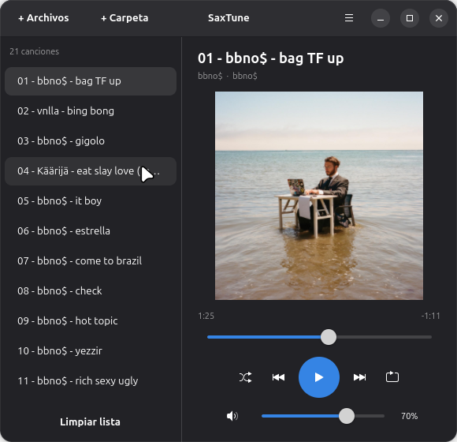
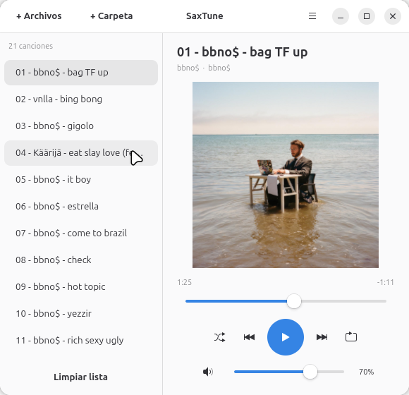

# SaxTune

A minimalist music player built with GTK4 and Adwaita for GNOME/Linux.

<p align="center">
  
  
</p>

## Features

- MP3 playback with album art
- MPRIS2 integration with the GNOME media panel
- Dark and light theme
- Shuffle and repeat modes
- Persistent playlist between sessions
- Volume control
- Available in English and Spanish

## Installation

Download the latest `.flatpak` from the [Releases](https://github.com/FelixSystem96/SaxTune/releases) page and run:

```bash
flatpak install SaxTune-X.X.X.flatpak
```

> Requires the [GNOME Platform runtime](https://flathub.org/apps/org.gnome.Platform). If you don't have it, Flatpak will install it automatically.

## Running from source

```bash
git clone https://github.com/FelixSystem96/SaxTune.git
cd SaxTune
./run.sh
```

## Building the Flatpak

```bash
flatpak run org.flatpak.Builder --force-clean --user --install build-dir io.github.felixsystem96.SaxTune.yml
```

## License

MIT © Felix Moya Ortega
